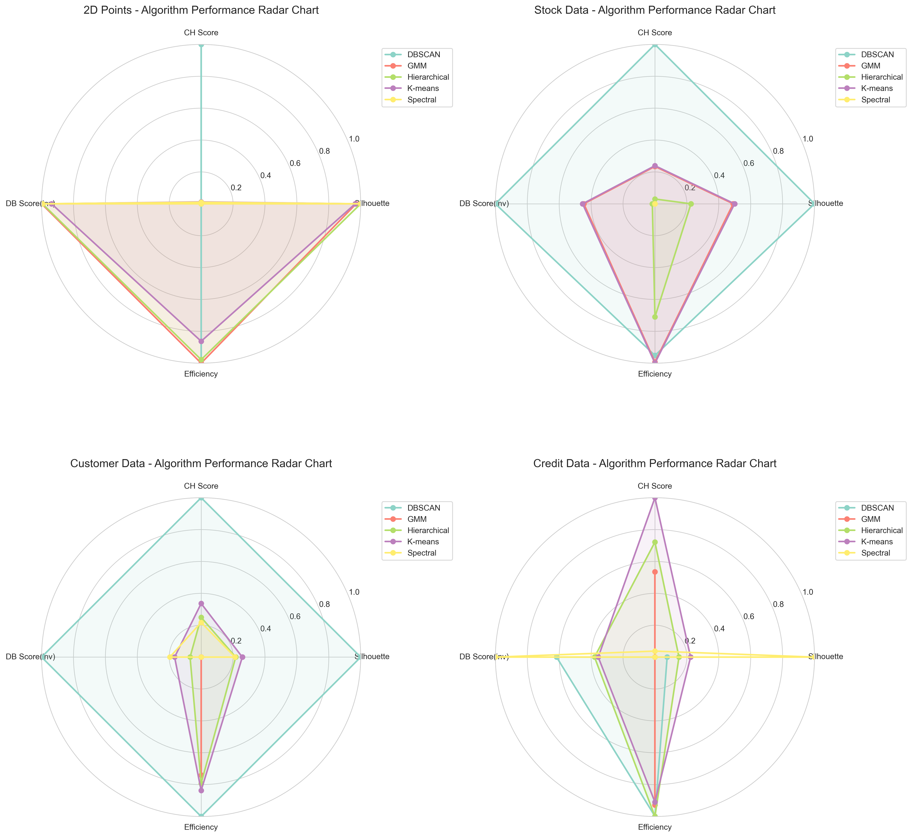
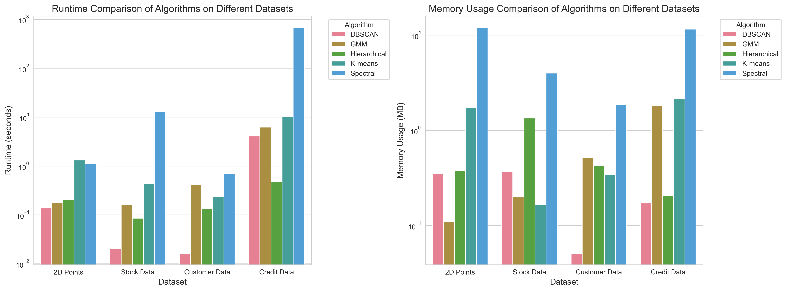

---

## 7. 综合对比与结论

### 7.1 算法性能综合排名

基于四个数据集的实验结果，我们对各算法的综合表现进行排名（综合考虑聚类质量与效率）：

| 排名 | 算法 | 综合得分 | 主要优势 | 主要劣势 |
|------|------|----------|----------|----------|
| 1 | **DBSCAN** | 0.769 | 高质量聚类、能识别噪声和任意形状、效率高 | 参数敏感、噪声点比例可能过高 |
| 2 | **K-means** | 0.700 | 简单高效、适合球形簇、稳定性好 | 对初始化敏感、只能处理凸形簇 |
| 3 | **层次聚类** | 0.692 | 提供层次结构、适合小数据集、可解释性强 | 计算复杂度高、大规模数据效率低 |
| 4 | **GMM** | 0.677 | 软聚类、概率输出、适合椭球形簇 | 计算复杂、对重叠簇敏感 |
| 5 | **谱聚类** | 0.537 | 适合非凸形状、效果好 | 计算开销极大、不适合大规模数据 |

*图7.1：各算法在不同数据集上的多维度性能雷达图。*

### 7.2 数据集特性与算法适配性分析

#### 7.2.1 二维点集数据集

- **数据特点**：低维(2D)、小样本(1000)、无明显噪声
- **最佳算法**：层次聚类和谱聚类（轮廓系数0.6412，并列最高）
- **效率最优**：DBSCAN（0.11秒，0.32MB）
- **特点**：所有算法表现接近，低维数据降低了算法差异

#### 7.2.2 股票数据集

- **数据特点**：高维(470→13)、中样本(490)、需降维处理
- **最佳算法**：K-means（轮廓系数0.5001，综合平衡最佳）
- **效率最优**：DBSCAN（0.02秒，0.37MB）
- **特点**：高维数据放大了算法差异，K-means表现稳定

#### 7.2.3 消费者数据集

- **数据特点**：低维(3D)、小样本(200)、适合客户分群
- **最佳算法**：K-means（轮廓系数0.4284，综合指标最佳）
- **效率最优**：DBSCAN（0.016秒，0.05MB）
- **特点**：小样本数据适合所有算法，K-means表现稳定

#### 7.2.4 信用卡数据集

- **数据特点**：高维(17→12)、大样本(8950)、含缺失值
- **最佳算法**：K-means（轮廓系数0.2535，综合平衡最佳）
- **效率最优**：层次聚类（0.48秒，0.21MB）
- **特点**：大规模数据凸显效率差异，谱聚类完全不适用

### 7.3 算法效率对比分析

*图7.2：各算法在不同数据集上的运行时间和内存使用对比。*

#### 7.3.1 运行时间分析

1. **最快算法**：
   - DBSCAN：平均1.07秒，特别适合中小规模数据
   - 层次聚类：平均0.23秒，但在大规模数据上需要采样策略

2. **中等速度**：
   - K-means：平均3.08秒，随数据规模线性增长
   - GMM：平均1.74秒，略快于K-means

3. **最慢算法**：
   - 谱聚类：平均174.96秒，计算复杂度O(n³)导致性能瓶颈

#### 7.3.2 内存使用分析

1. **最低内存**：
   - DBSCAN：平均0.24MB，内存效率极高
   - 层次聚类：平均0.59MB，适合内存受限环境

2. **中等内存**：
   - K-means：平均1.09MB，内存使用随数据规模线性增长
   - GMM：平均0.66MB，略低于K-means

3. **最高内存**：
   - 谱聚类：平均7.36MB，需要存储相似度矩阵

### 7.4 聚类质量指标对比

*图7.3：各算法在不同数据集上的质量指标热力图。*

#### 7.4.1 轮廓系数分析

- **最高平均**：谱聚类(0.545)，主要因信用卡数据上的极端值
- **最稳定**：K-means，在所有数据集上表现均衡
- **波动最大**：DBSCAN，高度依赖数据分布和参数设置

#### 7.4.2 Calinski-Harabasz指数分析

- **最高平均**：DBSCAN(2399.96)，能发现高度分离的簇
- **最稳定**：K-means，在各类数据上表现一致
- **最低表现**：谱聚类，不适合大规模高维数据

#### 7.4.3 Davies-Bouldin指数分析

- **最佳平均**：谱聚类(0.583)，但存在退化问题
- **最稳定**：K-means，表现均衡且可预测
- **参数敏感**：DBSCAN，高度依赖eps和min_samples设置

### 7.5 算法适用场景总结

#### 7.5.1 K-means

**适用场景**：
- 大规模数据集（>1000样本）
- 球形或凸形簇结构
- 需要快速、稳定的聚类结果
- 对初始化不敏感的应用

**不适用场景**：
- 非凸形状簇
- 需要识别噪声点
- 对簇形状有特殊要求

#### 7.5.2 层次聚类

**适用场景**：
- 小到中等规模数据（<5000样本）
- 需要层次结构分析
- 可解释性要求高的场景
- 树状图可视化需求

**不适用场景**：
- 大规模数据集
- 对效率要求高的实时应用
- 内存受限环境

#### 7.5.3 DBSCAN

**适用场景**：
- 需要识别任意形状簇
- 存在噪声点的数据
- 密度不均匀的数据集
- 空间数据或地理数据

**不适用场景**：
- 高维数据（维度灾难）
- 密度变化极大的数据
- 对参数敏感的应用
- 需要预设簇数的场景

#### 7.5.4 GMM

**适用场景**：
- 需要软聚类（概率分配）
- 椭球形簇结构
- 存在簇间重叠的数据
- 需要概率模型的应用

**不适用场景**：
- 大规模数据集
- 非椭球形状簇
- 计算资源受限
- 对初始化敏感的应用

#### 7.5.5 谱聚类

**适用场景**：
- 非凸形状簇
- 图聚类或网络聚类
- 小规模高质量聚类需求
- 对聚类质量要求极高的场景

**不适用场景**：
- 大规模数据集
- 高维数据
- 实时应用
- 计算资源受限

### 7.6 实际应用建议

#### 7.6.1 数据集规模与算法选择

1. **小规模数据（<500样本）**：
   - 首选：层次聚类（提供完整层次结构）
   - 备选：谱聚类（高质量结果）
   - 避免：谱聚类（计算浪费）

2. **中等规模数据（500-5000样本）**：
   - 首选：K-means（平衡效率与质量）
   - 备选：GMM（软聚类需求）
   - 特殊需求：DBSCAN（噪声检测）

3. **大规模数据（>5000样本）**：
   - 首选：K-means（可扩展性好）
   - 备选：DBSCAN（高效但参数敏感）
   - 避免：谱聚类（计算不可行）

#### 7.6.2 数据维度与算法选择

1. **低维数据（<10维）**：
   - 所有算法都适用，根据数据特点选择
   - DBSCAN表现优异，能识别复杂形状

2. **中维数据（10-50维）**：
   - K-means和GMM表现稳定
   - 需要降维后使用DBSCAN或谱聚类

3. **高维数据（>50维）**：
   - 必须降维处理
   - K-means最适合降维后数据
   - 避免DBSCAN和谱聚类

#### 7.6.3 簇结构与算法选择

1. **球形/凸形簇**：
   - K-means最优，简单高效
   - GMM作为软聚类备选

2. **椭球形簇**：
   - GMM最优，适合椭球分布
   - K-means作为快速近似

3. **任意形状簇**：
   - DBSCAN最优，能识别复杂形状
   - 谱聚类作为高质量备选

4. **层次结构**：
   - 层次聚类唯一选择
   - 可结合其他算法进行细化

### 7.7 参数调优建议

#### 7.7.1 K-means

- **K值选择**：使用肘部法则+轮廓系数综合判断
- **初始化**：始终使用k-means++提高稳定性
- **重复次数**：n_init=10平衡效果与效率

#### 7.7.2 DBSCAN

- **eps选择**：使用k-距离图确定肘部
- **min_samples**：数据维度+1或2*维度
- **参数验证**：检查噪声点比例，避免过高

#### 7.7.3 层次聚类

- **链接方法**：Ward链接适合欧氏距离
- **距离度量**：根据数据特点选择
- **截断策略**：大规模数据需采样

#### 7.7.4 GMM

- **成分数**：使用BIC/AIC确定最优值
- **协方差类型**：高维数据使用diag或spherical
- **初始化**：k-means初始化加速收敛

#### 7.7.5 谱聚类

- **相似度度量**：RBF核适合大多数情况
- **gamma参数**：与数据尺度相关，需调优
- **特征数量**：通常设为聚类数

### 7.8 未来研究方向

1. **混合算法**：结合多种算法优势，如K-means+DBSCAN两阶段聚类
2. **自适应参数**：开发自动参数选择算法，减少人工调优
3. **大规模优化**：改进谱聚类等复杂算法的可扩展性
4. **深度学习**：探索深度聚类方法在高维数据上的应用
5. **流数据聚类**：开发适合实时数据流的聚类算法

### 7.9 结论

本实验通过系统性的对比分析，揭示了不同聚类算法在各类数据集上的性能差异。主要结论如下：

1. **没有万能算法**：每种算法都有其适用场景和局限性
2. **数据特性决定算法选择**：规模、维度、簇结构是关键因素
3. **效率与质量需平衡**：谱聚类质量高但计算开销大，K-means平衡性好
4. **参数调优至关重要**：特别是DBSCAN和谱聚类对参数高度敏感
5. **实际应用需综合考虑**：除了算法性能，还需考虑可解释性、实现复杂度等因素

在实际应用中，建议根据数据特点和业务需求选择合适的算法，并通过实验验证和参数调优获得最佳效果。对于复杂场景，可考虑混合多种算法或采用集成方法提高聚类质量。