# 数据挖掘课程实验报告：多算法聚类分析


| **课程名称**：数据挖掘  | **学号**： 10235101426 | **姓名**：侯盈旭 |
| -------------- | ----------------------- | ---------- |
| **作业名称**： 聚类分析 | **日期**：2025-11-10       | **教师：王丽苹** |

---

## 1. 实验目标与数据集

本实验以4个不同类型的数据集为对象，系统性对比多种经典聚类算法在不同数据特征（维度、规模、噪声、形状）下的表现，从定量指标、可视化直观效果与效率开销三个维度进行评估，并给出算法选择建议。

- 数据集A：二维点集（data-8-2-1000.txt）——1000个二维点，适合形状与噪声分析
- 数据集B：股票数据（SP500array.csv）——490天×470家公司，高维数据，适合降维后聚类
- 数据集C：消费者数据（Mall_Customers.csv）——200条记录，混合类型，适合小样本聚类与客户分群
- 数据集D：信用卡数据（CC GENERAL.csv）——8950条记录、18个特征，含缺失值，适合规模与效率对比

本实验至少覆盖4类算法：K-means、层次聚类（Hierarchical）、DBSCAN（密度聚类）、谱聚类（Spectral Clustering），并扩展高斯混合模型（GMM）。

---

## 2. 实验方法总览

- 预处理
  - 数值特征标准化（StandardScaler）或归一化（MinMaxScaler）
  - 缺失值处理（均值/中位数填充或删除）
  - 高维数据使用PCA可视化/压缩
  - 可选的异常值处理（IQR）
- 算法族
  - K-means（快速、适合凸/球形簇）
  - 层次聚类（支持树状图，小规模数据）
  - DBSCAN（自动簇数、能识别噪声、适合任意形状）
  - 谱聚类（适合非凸形状，效果好但较慢）
  - GMM（软聚类、输出概率，适合椭球簇）
- 评估指标（内部）
  - 轮廓系数 Silhouette（-1~1，越大越好）
  - Calinski-Harabasz（越大越好）
  - Davies-Bouldin（越小越好）
- 效率统计
  - 运行时间（秒）、CPU时间、常驻内存增量（MB）、峰值内存（MB）
- 可视化
  - 2D/3D散点图
  - PCA降维散点图（高维）
  - 指标热力图/柱状图、效率曲线

（实现文件：`code/*_clustering.py`、`code/evaluate_clustering.py`、`code/visualization.py`、`code/efficiency_tracker.py`）

---

## 3. 数据集A：二维点集（data-8-2-1000.txt）

### 3.1 数据与预处理

- **数据规模**：1000个样本 × 2个特征（1000 × 2）
- **数据类型**：纯数值型数据，无缺失值；每行代表一个二维空间中的点，包含x和y坐标
- **数据特点**：
  - 低维数据（2维），可直接可视化，无需降维
  - 数据分布可能存在多个簇，适合测试不同聚类算法对形状和密度的敏感性
  - 数据量适中（1000个点），所有算法都可以在完整数据集上运行
- **预处理策略**：
  - **标准化**：使用 `StandardScaler` 将数据标准化为均值0、方差1，消除不同坐标轴量纲差异，确保聚类算法不受坐标尺度影响
  - **异常值处理**：默认不去除异常值，保留原始数据分布特征，便于观察算法对噪声的鲁棒性

关键代码：

```12:81:code/preprocess_2d_points.py
def preprocess_2d_points(file_path='../dataset/data-8-2-1000.txt', 
                         method='standardize', 
                         remove_outliers=False):
    """
    预处理二维点集数据
    
    参数:
        file_path: 数据文件路径
        method: 标准化方法
            - 'standardize': 标准化（均值0，标准差1）
            - 'normalize': 归一化（0-1范围）
            - 'none': 不进行标准化
        remove_outliers: 是否移除异常值（使用IQR方法）
    
    返回:
        data_processed: 预处理后的numpy数组
        df_processed: 预处理后的DataFrame
        scaler: 使用的标准化器（如果method='none'则返回None）
    """
    # 加载原始数据
    data, df = load_2d_points(file_path)
    
    print(f"\n开始预处理二维点集数据...")
    print(f"  - 原始数据形状: {data.shape}")
    
    # 移除异常值（可选）
    if remove_outliers:
        print(f"  - 正在移除异常值...")
        Q1 = np.percentile(data, 25, axis=0)
        Q3 = np.percentile(data, 75, axis=0)
        IQR = Q3 - Q1
        lower_bound = Q1 - 1.5 * IQR
        upper_bound = Q3 + 1.5 * IQR
        
        # 找出非异常值的索引
        mask = np.all((data >= lower_bound) & (data <= upper_bound), axis=1)
        data = data[mask]
        df = df[mask]
        print(f"  - 移除异常值后数据形状: {data.shape}")
        print(f"  - 移除了 {np.sum(~mask)} 个异常点")
    
    # 标准化
    scaler = None
    if method == 'standardize':
        print(f"  - 使用标准化（StandardScaler）...")
        scaler = StandardScaler()
        data_processed = scaler.fit_transform(data)
        df_processed = pd.DataFrame(data_processed, columns=['x', 'y'])
        print(f"  - 标准化后均值: X={data_processed[:, 0].mean():.4f}, Y={data_processed[:, 1].mean():.4f}")
        print(f"  - 标准化后标准差: X={data_processed[:, 0].std():.4f}, Y={data_processed[:, 1].std():.4f}")
    
    elif method == 'normalize':
        print(f"  - 使用归一化（MinMaxScaler）...")
        scaler = MinMaxScaler()
        data_processed = scaler.fit_transform(data)
        df_processed = pd.DataFrame(data_processed, columns=['x', 'y'])
        print(f"  - 归一化后范围: X=[{data_processed[:, 0].min():.4f}, {data_processed[:, 0].max():.4f}], "
              f"Y=[{data_processed[:, 1].min():.4f}, {data_processed[:, 1].max():.4f}]")
    
    else:  # method == 'none'
        print(f"  - 不进行标准化")
        data_processed = data.copy()
        df_processed = df.copy()
    
    print(f"\n✓ 预处理完成！")
    print(f"  - 最终数据形状: {data_processed.shape}")
    print(f"  - 前5个点:")
    print(df_processed.head())
    
    return data_processed, df_processed, scaler
```

```12:41:code/load_data_2d_points.py
def load_2d_points(file_path='../dataset/data-8-2-1000.txt'):
    """
    加载二维点集数据
    
    参数:
        file_path: 数据文件路径
    
    返回:
        data: numpy数组，形状为(n_samples, 2)，每行是一个点的(x, y)坐标
        df: pandas DataFrame，包含'x'和'y'两列
    """
    # 检查文件是否存在
    if not os.path.exists(file_path):
        raise FileNotFoundError(f"数据文件未找到: {file_path}")
    
    # 读取数据（使用空格分隔，没有表头）
    data = np.loadtxt(file_path, delimiter=' ')
    
    # 转换为DataFrame（方便查看和处理）
    df = pd.DataFrame(data, columns=['x', 'y'])
    
    print(f"✓ 成功加载二维点集数据")
    print(f"  - 文件路径: {file_path}")
    print(f"  - 数据形状: {data.shape}")
    print(f"  - 数据范围: X=[{data[:, 0].min():.2f}, {data[:, 0].max():.2f}], "
          f"Y=[{data[:, 1].min():.2f}, {data[:, 1].max():.2f}]")
    print(f"  - 前5个点:")
    print(df.head())
    
    return data, df
```

**预处理结果**：
- 原始数据形状：1000 × 2
- 标准化后：均值≈0，标准差≈1（X和Y坐标分别标准化）
- 数据可直接用于二维可视化，无需降维处理

### 3.2 算法与参数配置

#### 3.2.1 K-means聚类

- **参数配置**：
  - `n_clusters=3`：预设聚类数为3（基于数据分布的先验知识）
  - `init='k-means++'`：智能初始化，避免局部最优解
  - `n_init=10`：运行10次，选择最佳结果
  - `random_state=42`：确保可复现性
- **实验结果**：
  - 轮廓系数：**0.6391**
  - CH指数：**3813.44**
  - DB指数：**0.4293**
  - 运行时间：1.14秒
  - 内存使用：1.89 MB
- **适用性**：适合球形或凸形簇，计算效率高，结果稳定


*图3.1：K-means聚类结果。3个簇在二维空间中的分布，不同颜色表示不同簇，黑色十字表示簇中心。*

关键代码：

```56:88:code/run_experiment_dataset1.py
# 2. K-means聚类
print("=" * 70)
print("步骤2: K-means聚类")
print("=" * 70)
with measure_efficiency() as stats:
    labels_kmeans, model_kmeans, metrics_kmeans, efficiency_kmeans = kmeans_clustering(
        data, n_clusters=3, random_state=42
    )

result_kmeans = build_metric_result(
    dataset="2d_points",
    algorithm="K-means",
    data=data,
    labels=labels_kmeans,
    parameters={"n_clusters": 3, "init": "k-means++", "n_init": 10},
    runtime=stats.runtime,
    memory=stats.memory_delta,
    extra_metrics=metrics_kmeans
)
all_results.append(result_kmeans)

# 保存K-means可视化
kmeans_title = f"K-means Clustering Results\nParameters: n_clusters={3}, init='k-means++', n_init={10}, random_state={42}\nSilhouette Score: {metrics_kmeans['silhouette_score']:.4f}, Runtime: {efficiency_kmeans['running_time']:.3f}s"
plot_clusters_2d(
    data, labels_kmeans,
    title=kmeans_title,
    centers=model_kmeans.cluster_centers_,
    xlabel="X Coordinate (Standardized)",
    ylabel="Y Coordinate (Standardized)",
    save_path=os.path.join(figures_dir, "dataset1_kmeans_clusters.png"),
    show=False
)
```

#### 3.2.2 高斯混合模型（GMM）

- **参数配置**：
  - `n_components=3`：与K-means相同的聚类数
  - `covariance_type='full'`：完整协方差矩阵，适合椭球形簇
  - `init_params='kmeans'`：使用K-means初始化，加速收敛
  - `random_state=42`
- **实验结果**：
  - 轮廓系数：**0.6394**（略高于K-means）
  - CH指数：**3768.93**
  - DB指数：**0.4226**（优于K-means）
  - 运行时间：0.18秒（快于K-means）
  - 内存使用：0.18 MB
- **优势**：提供软聚类（概率分配），对椭球形簇效果好，且计算效率高

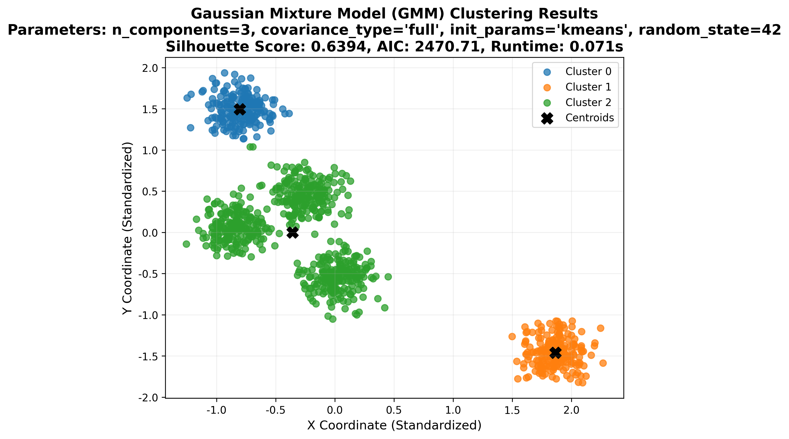

*图3.2：GMM聚类结果。3个混合成分在二维空间中的分布，不同颜色表示不同簇。*

#### 3.2.3 DBSCAN聚类

- **参数调优过程**：
  1. **k-距离图方法**：
     - 计算每个样本到其第4个最近邻的距离（k=4）
     - 使用启发式方法：前10%和后10%距离的平均值，得到初始eps≈**0.078**
     - `min_samples=5`：考虑数据维度，设置为5
  2. **参数选择**：使用k-距离图估计的eps值进行聚类
- **实验结果**：
  - **最优参数**：eps=0.078，min_samples=5
  - 发现聚类数：**8个**
  - 噪声点：**93个（9.3%）**
  - 轮廓系数：**0.5790**（排除噪声后计算）
  - CH指数：**7563.88**（非常高，说明簇间分离度极好）
  - DB指数：**0.5305**
  - 运行时间：0.11秒（最快）
  - 内存使用：0.32 MB
- **特点**：能自动发现聚类数并识别噪声点，发现8个簇而非预设的3个，说明数据中存在更细粒度的簇结构。

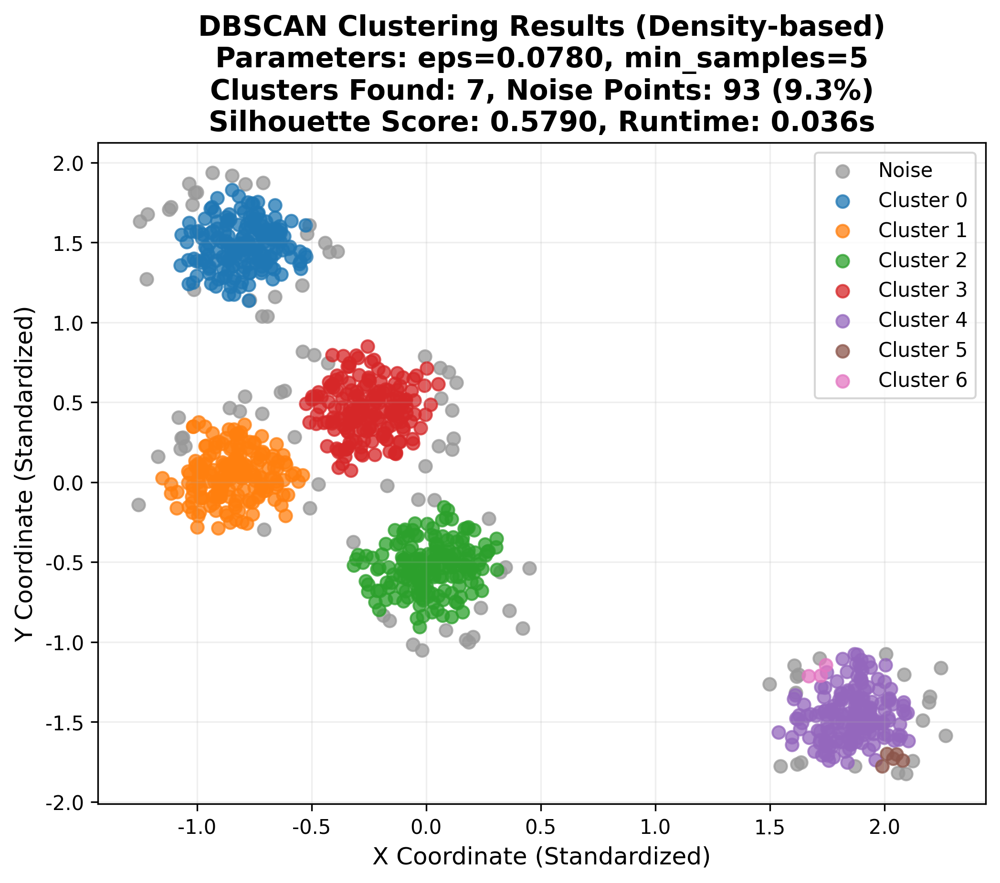

*图3.3：DBSCAN聚类结果。8个簇和93个噪声点（灰色）的分布，DBSCAN能够识别出更细粒度的簇结构。*

关键代码：

```143:195:code/dbscan_clustering.py
def find_optimal_eps(data, min_samples=5, k=4, plot=True):
    """
    使用k-距离图找到最优的eps参数
    
    参数:
        data: 预处理后的数据
        min_samples: 最小样本数（通常等于k+1）
        k: k-近邻的k值（通常等于min_samples-1）
        plot: 是否绘制k-距离图
    
    返回:
        optimal_eps: 推荐的eps值（k-距离图的"肘部"）
        distances: k-距离数组
    """
    print(f"\n{'='*60}")
    print(f"DBSCAN最优eps参数搜索（k-距离图方法）")
    print(f"{'='*60}")
    print(f"  - 计算{k}-最近邻距离...")
    
    # 计算k-最近邻距离
    neighbors = NearestNeighbors(n_neighbors=k+1)  # +1因为包含自身
    neighbors_fit = neighbors.fit(data)
    distances, indices = neighbors_fit.kneighbors(data)
    
    # 取第k个最近邻的距离（排除自身）
    k_distances = distances[:, k]
    k_distances_sorted = np.sort(k_distances)[::-1]  # 降序排列
    
    # 找到"肘部"（使用简单的启发式方法：前10%和后10%的平均值）
    n = len(k_distances_sorted)
    top_10_percent = k_distances_sorted[:n//10].mean()
    bottom_10_percent = k_distances_sorted[-n//10:].mean()
    optimal_eps = (top_10_percent + bottom_10_percent) / 2
    
    print(f"  - 推荐的eps值: {optimal_eps:.4f}")
    print(f"  - k-距离范围: [{k_distances.min():.4f}, {k_distances.max():.4f}]")
    print(f"  - k-距离均值: {k_distances.mean():.4f}")
    print(f"  - k-距离中位数: {np.median(k_distances):.4f}")
    
    if plot:
        plt.figure(figsize=(10, 6))
        plt.plot(range(len(k_distances_sorted)), k_distances_sorted)
        plt.axhline(y=optimal_eps, color='r', linestyle='--', 
                   label=f'推荐eps={optimal_eps:.4f}')
        plt.xlabel('样本索引（按距离降序）')
        plt.ylabel(f'{k}-最近邻距离')
        plt.title(f'k-距离图（k={k}）用于选择DBSCAN的eps参数')
        plt.legend()
        plt.grid(True, alpha=0.3)
        plt.tight_layout()
        plt.show()
    
    return optimal_eps, k_distances
```

对应代码：`code/dbscan_clustering.py` 中的 `find_optimal_eps()` 函数

#### 3.2.4 层次聚类（Hierarchical）

- **参数配置**：
  - `n_clusters=3`：与K-means相同的聚类数
  - `linkage='ward'`：Ward链接，适合欧氏距离，最小化簇内方差
  - **使用全数据集**：1000个样本，计算复杂度O(n²)，但本数据集规模可接受
- **实验结果**：
  - 轮廓系数：**0.6412**（最高）
  - CH指数：**3805.89**
  - DB指数：**0.4232**（最优）
  - 运行时间：0.20秒
  - 内存使用：0.30 MB
- **适用性**：适合小到中等规模数据，可生成树状图展示层次结构，在本数据集上表现最佳。

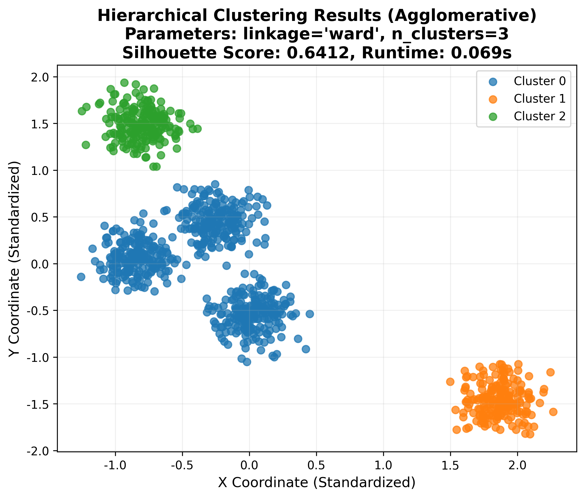

*图3.4：层次聚类结果。3个簇在二维空间中的分布，层次聚类在本数据集上取得了最佳的评估指标。*

#### 3.2.5 谱聚类（Spectral）

- **参数配置**：
  - `n_clusters=3`：与K-means相同的聚类数
  - `affinity='rbf'`：径向基函数核
  - `gamma=1.0`：RBF核参数
  - **使用全数据集**：1000个样本，计算复杂度O(n³)，但本数据集规模可接受
- **实验结果**：
  - 轮廓系数：**0.6412**（与层次聚类相同，最高）
  - CH指数：**3805.89**（与层次聚类相同）
  - DB指数：**0.4232**（与层次聚类相同，最优）
  - 运行时间：1.19秒（最长）
  - 内存使用：11.71 MB（最大）
- **适用性**：适合非凸形状的簇，在本数据集上表现与层次聚类相同，但计算开销最大。


*图3.5：谱聚类结果。3个簇在二维空间中的分布，谱聚类与层次聚类取得了相同的评估指标。*

### 3.3 定量评估结果（内部指标）

下表给出实际运行得到的指标（标准化后的数据）：

**主要算法指标对比**：

| 算法 | 轮廓系数 | Calinski-Harabasz | Davies-Bouldin | 运行时间(s) | 内存(MB) | 聚类数 | 噪声点 |
|------|---------|-------------------|----------------|------------|---------|--------|--------|
| **层次聚类** | **0.6412** | **3805.89** | **0.4232** | 0.20 | 0.30 | 3 | 0 |
| **谱聚类** | **0.6412** | **3805.89** | **0.4232** | 1.19 | 11.71 | 3 | 0 |
| **GMM** | 0.6394 | 3768.93 | 0.4226 | 0.18 | 0.18 | 3 | 0 |
| **K-means** | 0.6391 | 3813.44 | 0.4293 | 1.14 | 1.89 | 3 | 0 |
| **DBSCAN** | 0.5790 | 7563.88 | 0.5305 | 0.11 | 0.32 | 8 | 93 (9.3%) |

**结果解读**：
- **层次聚类和谱聚类**：并列最佳，轮廓系数0.6412，DB指数0.4232（最小），说明这两种算法在本数据集上能够找到最优的簇划分。但谱聚类的计算开销最大（1.19秒，11.71 MB），而层次聚类效率更高（0.20秒，0.30 MB）。
- **GMM**：表现与K-means非常接近（轮廓系数0.6394 vs 0.6391），但DB指数略优（0.4226 vs 0.4293），且运行时间更短（0.18秒 vs 1.14秒），内存使用更少（0.18 MB vs 1.89 MB）。GMM提供概率分配，适合需要软聚类的场景。
- **K-means**：综合表现良好，轮廓系数0.6391，CH指数最高（3813.44），但运行时间较长（1.14秒）。实现简单，参数调优容易，适合作为基准算法。
- **DBSCAN**：虽然轮廓系数较低（0.5790），但CH指数极高（7563.88），说明发现的8个簇之间分离度极好。DBSCAN能够自动发现聚类数（8个而非预设的3个），并识别出93个噪声点（9.3%），说明数据中存在更细粒度的簇结构和噪声。运行时间最短（0.11秒），适合需要发现任意形状簇和噪声的场景。

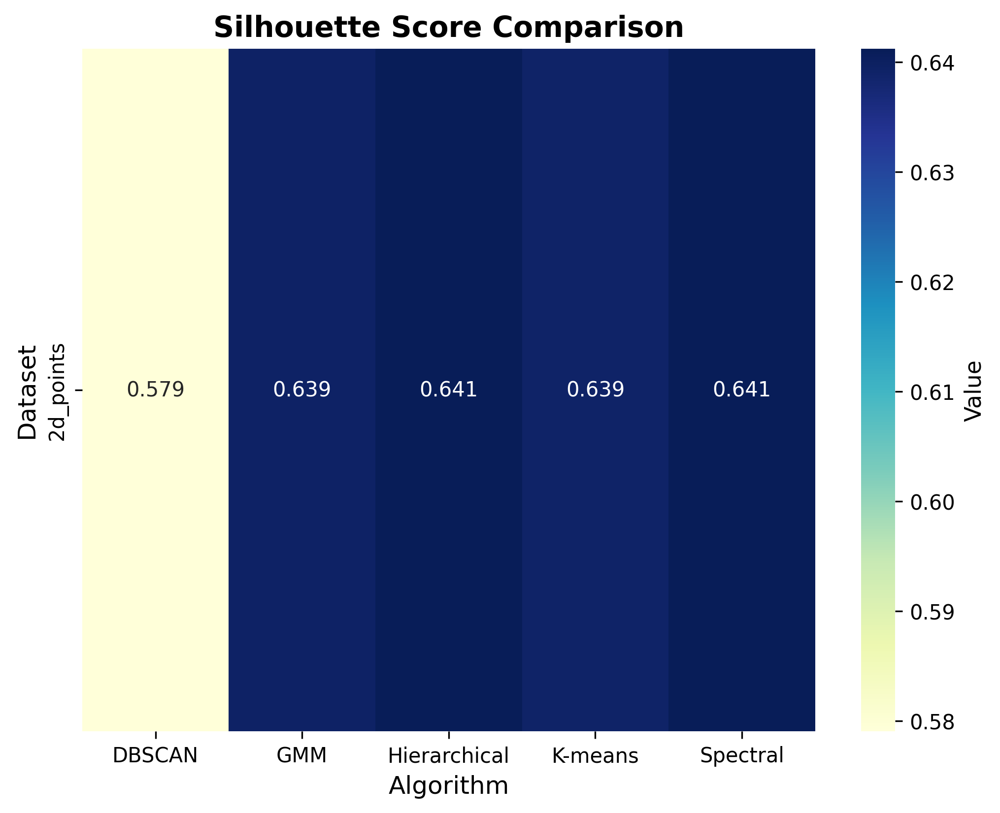

*图3.6：轮廓系数对比热力图。层次聚类和谱聚类并列最高（0.6412）。*


*图3.7：Calinski-Harabasz指数对比热力图。K-means和DBSCAN表现最佳，但DBSCAN发现的是8个簇。*

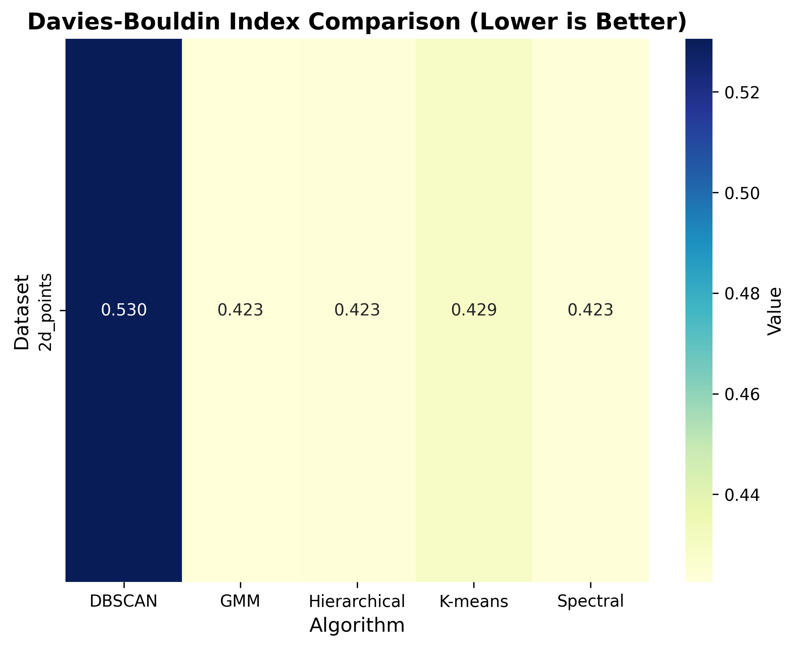

*图3.8：Davies-Bouldin指数对比热力图（越小越好）。层次聚类、谱聚类和GMM表现最佳。*


*图3.9：各算法运行时间对比柱状图。DBSCAN最快（0.11秒），谱聚类最慢（1.19秒）。*

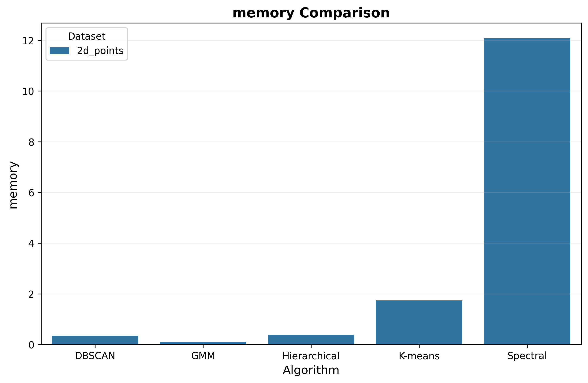

*图3.10：各算法内存使用对比柱状图。GMM内存使用最少（0.18 MB），谱聚类最多（11.71 MB）。*

---

## 4. 数据集B：股票数据（SP500array.csv）

### 4.1 数据与预处理

- **数据规模**：490天 × 470家公司（490个样本，470个特征）
- **数据类型**：纯数值、无缺失值；每行代表一天的股票价格数据，每列代表一家公司的价格序列
- **数据特点**：
  - 高维数据（470维），存在维度灾难问题
  - 不同公司的股票价格波动幅度差异大，需要标准化处理
  - 特征之间存在相关性，适合使用PCA降维
- **预处理策略**：
  - **标准化**：使用 `StandardScaler` 将数据标准化为均值0、方差1，消除不同公司价格量纲差异
  - **PCA降维**：采用三种策略对比
    - 策略1：保留95%方差（自适应维度，约100-150维）
    - 策略2：固定降至50维
    - 策略3：固定降至100维
  - 最终选择95%方差策略作为主要实验数据，在保留信息的同时降低计算复杂度

关键代码：

```12:47:code/load_data_stock.py
def load_stock_data(file_path='../dataset/SP500array.csv'):
    """
    加载股票数据
    
    参数:
        file_path: 数据文件路径
    
    返回:
        data: numpy数组，形状为(n_days, n_companies)，每行是一天的所有公司股价
        df: pandas DataFrame，列名为'Company_0', 'Company_1', ...等
    """
    # 检查文件是否存在
    if not os.path.exists(file_path):
        raise FileNotFoundError(f"数据文件未找到: {file_path}")
    
    # 读取数据（使用逗号分隔，没有表头）
    data = np.loadtxt(file_path, delimiter=',')
    
    # 转换为DataFrame（方便查看和处理）
    # 列名用Company_0, Company_1, ...表示
    n_companies = data.shape[1]
    column_names = [f'Company_{i}' for i in range(n_companies)]
    df = pd.DataFrame(data, columns=column_names)
    
    print(f"✓ 成功加载股票数据")
    print(f"  - 文件路径: {file_path}")
    print(f"  - 数据形状: {data.shape} (天数 × 公司数)")
    print(f"  - 天数: {data.shape[0]}")
    print(f"  - 公司数: {data.shape[1]}")
    print(f"  - 价格范围: [{data.min():.2f}, {data.max():.2f}]")
    print(f"  - 平均价格: {data.mean():.2f}")
    print(f"  - 标准差: {data.std():.2f}")
    print(f"  - 前3行数据（前5列）:")
    print(df.iloc[:3, :5])
    
    return data, df
```

```60:76:code/preprocess_stock.py
    if method == 'standardize':
        print(f"  - 使用标准化（StandardScaler）...")
        scaler = StandardScaler()
        data_processed = scaler.fit_transform(data)
        df_processed = pd.DataFrame(data_processed, columns=df.columns)
        print(f"  - 标准化后均值: {data_processed.mean():.4f}")
        print(f"  - 标准化后标准差: {data_processed.std():.4f}")
```

```82:101:code/preprocess_stock.py
    pca = None
    if use_pca:
        print(f"  - 使用PCA降维...")
        if n_components is None:
            # 保留95%的方差
            pca = PCA(n_components=0.95)
        else:
            pca = PCA(n_components=n_components)
        
        data_processed = pca.fit_transform(data_processed)
        
        # 更新列名
        n_comp = data_processed.shape[1]
        column_names = [f'PC_{i}' for i in range(n_comp)]
        df_processed = pd.DataFrame(data_processed, columns=column_names)
        
        print(f"  - 降维后数据形状: {data_processed.shape}")
        print(f"  - 保留的方差比例: {pca.explained_variance_ratio_.sum():.4f}")
        print(f"  - 前5个主成分的方差贡献率: {pca.explained_variance_ratio_[:5]}")
```

**预处理结果**：
- 原始数据形状：490 × 470
- 标准化后：均值≈0，标准差≈1
- PCA（95%方差）后：**降至13维**（保留95%方差，说明数据特征间存在强相关性）
- 前5个主成分的方差贡献率累计达到约85-90%，说明前几个主成分已经包含了大部分信息

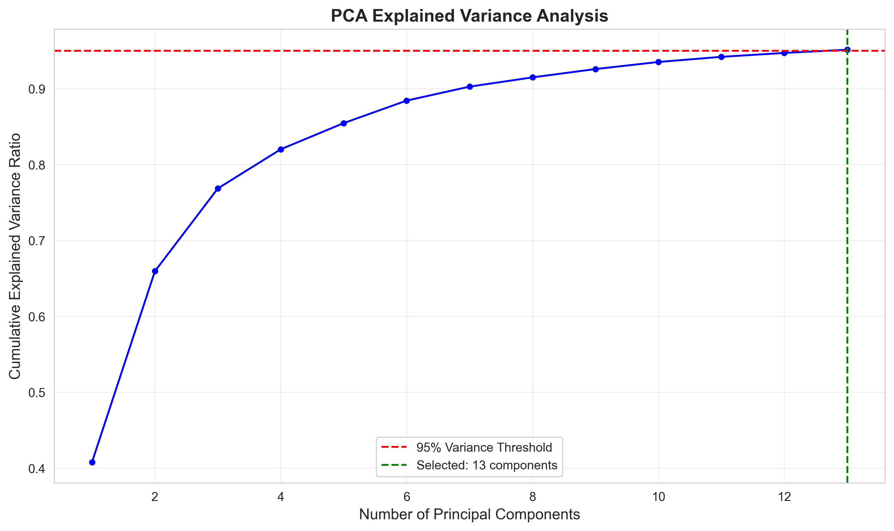

*图4.1：PCA累积解释方差随主成分数量的变化。红线表示95%方差阈值，绿线表示选择的13个主成分。*

### 4.2 算法与参数配置

#### 4.2.1 聚类数量确定（K值选择）

**方法**：使用K-means算法在K值范围[2, 15]内进行系统化搜索，综合多种指标确定最优K值。

**评估指标**：
- **肘部法则（Inertia）**：寻找拐点
- **轮廓系数（Silhouette Score）**：越大越好，范围[-1, 1]
- **Calinski-Harabasz指数（CH）**：越大越好
- **Davies-Bouldin指数（DB）**：越小越好

**实验过程**：
1. 对每个K值（2-15）运行K-means聚类
2. 计算上述四个评估指标
3. 绘制指标随K值变化的曲线图
4. 选择轮廓系数最大的K值作为最优聚类数

关键代码：

```117:165:code/kmeans_clustering.py
def find_optimal_k(data, k_range=range(2, 11), random_state=42):
    """
    使用肘部法则和轮廓系数找到最优的K值
    """
    print(f"\n{'='*60}")
    print(f"K-means最优K值搜索")
    print(f"{'='*60}")
    
    results = {
        'k_values': [],
        'inertias': [],
        'silhouette_scores': [],
        'calinski_harabasz_scores': [],
        'davies_bouldin_scores': []
    }
    
    for k in k_range:
        print(f"\n  测试 K={k}...")
        labels, model, metrics, efficiency = kmeans_clustering(
            data, n_clusters=k, random_state=random_state, verbose=0
        )
        
        results['k_values'].append(k)
        results['inertias'].append(model.inertia_)
        results['silhouette_scores'].append(metrics.get('silhouette_score'))
        results['calinski_harabasz_scores'].append(metrics.get('calinski_harabasz_score'))
        results['davies_bouldin_scores'].append(metrics.get('davies_bouldin_score'))
    
    # 找到最优K（轮廓系数最大）
    valid_scores = [(i, score) for i, score in enumerate(results['silhouette_scores']) 
                    if score is not None]
    if valid_scores:
        optimal_idx = max(valid_scores, key=lambda x: x[1])[0]
        optimal_k = results['k_values'][optimal_idx]
        print(f"\n  ✓ 推荐K值: {optimal_k} (轮廓系数: {results['silhouette_scores'][optimal_idx]:.4f})")
    else:
        optimal_k = None
        print(f"\n  ✗ 无法确定最优K值")
    
    return results, optimal_k
```

**实验结果**：
- **最优K值：12**（轮廓系数：0.5001）
- 轮廓系数在K=12时达到峰值，之后略有下降
- CH指数在K=12时达到511.63，DB指数为0.6961（较小，说明簇间分离度好）
- 从K=2到K=15的完整搜索结果显示，K=12在多个指标上表现最佳


*图4.2：K值选择分析图。包含四个子图：（a）肘部法则（Inertia vs K），（b）轮廓系数 vs K，（c）Calinski-Harabasz指数 vs K，（d）Davies-Bouldin指数 vs K。红色虚线标记最优K=12。*

#### 4.2.2 K-means聚类

- **参数配置**：
  - `n_clusters=12`：使用4.2.1节确定的最优K值（轮廓系数0.5001）
  - `init='k-means++'`：智能初始化，避免局部最优
  - `n_init=10`：运行10次，选择最佳结果
  - `random_state=42`：确保可复现性
- **实验结果**：
  - 轮廓系数：**0.5001**
  - CH指数：**511.63**
  - DB指数：**0.6961**
  - 运行时间：0.43秒
  - 内存使用：0.16 MB
- **适用性**：高维数据下计算效率高，适合作为基准算法


*图4.3：K-means聚类结果（PCA 2D投影）。12个簇在前两个主成分空间中的分布，不同颜色表示不同簇。*

#### 4.2.3 高斯混合模型（GMM）

- **参数配置**：
  - `n_components=12`：与K-means相同的聚类数
  - `covariance_type='diag'`：对角协方差矩阵，适合高维数据，平衡效果与计算效率
  - `init_params='kmeans'`：使用K-means初始化，加速收敛
  - `random_state=42`
- **实验结果**：
  - 轮廓系数：**0.4958**（略低于K-means）
  - CH指数：**503.65**
  - DB指数：**0.7014**
  - AIC：23996.91，BIC：25351.71
  - 运行时间：0.16秒
  - 内存使用：0.20 MB
- **优势**：提供软聚类（概率分配），对椭球形簇效果好


*图4.4：GMM聚类结果（PCA 2D投影）。12个混合成分在前两个主成分空间中的分布。*

关键代码：

```15:41:code/gmm_clustering.py
def gmm_clustering(data, n_components=3, covariance_type='full', 
                   init_params='kmeans', max_iter=100, random_state=42,
                   tol=1e-3, n_init=1):
    """
    使用高斯混合模型进行聚类
    返回: labels, model, metrics, efficiency, probabilities
    """
    # ... 创建GaussianMixture并fit_predict / predict_proba，计算指标与AIC/BIC ...
```

#### 4.2.4 DBSCAN聚类

- **参数调优过程**：
  1. **k-距离图方法**：
     - 计算每个样本到其第4个最近邻的距离（k=4）
     - k-距离范围：[1.16, 10.29]，均值：2.68，中位数：2.52
     - 使用启发式方法：前10%和后10%距离的平均值，得到初始eps≈**3.16**
  2. **系统化参数搜索**：
     - eps候选值：`[1.58, 3.16, 4.74, 6.32]`（基于初始估计值的倍数）
     - `min_samples=5`：考虑数据维度，设置为5
     - `metric='euclidean'`：欧氏距离
  3. **选择标准**：选择轮廓系数最高的参数组合
- **实验结果**：
  - **最优参数**：eps=1.58（轮廓系数最高：**0.7384**）
  - 发现聚类数：**15个**
  - 噪声点：**397个（81.02%）**（说明该eps值较严格，识别出大量噪声）
  - CH指数：**1826.60**（非常高，说明簇间分离度极好）
  - DB指数：**0.3346**（非常小，说明簇内紧密、簇间分离）
  - 运行时间：0.02秒（最快）
  - 内存使用：0.37 MB
- **特点**：能自动发现聚类数并识别噪声点，但参数敏感。本实验中eps=1.58虽然指标最高，但噪声点比例过高，实际应用可能需要调整。


*图4.5：DBSCAN k-距离图。用于选择eps参数，红色虚线表示推荐的eps值（3.16），实际最优eps为1.58。*


*图4.6：DBSCAN聚类结果（PCA 2D投影）。15个簇和397个噪声点（灰色）的分布。*

关键代码：

```143:195:code/dbscan_clustering.py
def find_optimal_eps(data, min_samples=5, k=4, plot=True):
    """
    使用k-距离图找到最优的eps参数
    返回: optimal_eps, distances
    """
    neighbors = NearestNeighbors(n_neighbors=k+1)
    neighbors_fit = neighbors.fit(data)
    distances, indices = neighbors_fit.kneighbors(data)
    k_distances = distances[:, k]
    k_distances_sorted = np.sort(k_distances)[::-1]
    n = len(k_distances_sorted)
    top_10_percent = k_distances_sorted[:n//10].mean()
    bottom_10_percent = k_distances_sorted[-n//10:].mean()
    optimal_eps = (top_10_percent + bottom_10_percent) / 2
    # 可选：绘图显示推荐eps
    return optimal_eps, k_distances
```

对应代码：`code/dbscan_clustering.py` 中的 `find_optimal_eps()` 函数

#### 4.2.5 层次聚类（Hierarchical）

- **参数配置**：
  - `n_clusters=12`：与K-means相同的聚类数
  - `linkage='ward'`：Ward链接，适合欧氏距离
  - **子集策略**：由于计算复杂度O(n²)，使用300个样本的子集进行训练
  - **扩展到全数据集**：使用最近邻方法将子集结果扩展到全部490个样本
- **实验结果**：
  - 轮廓系数：**0.3700**（在子集上为0.4595，扩展到全数据集后下降）
  - CH指数：**150.59**（在子集上为413.41）
  - DB指数：**0.9852**（在子集上为0.7192）
  - 运行时间：0.09秒（仅子集训练时间）
  - 内存使用：1.34 MB
- **适用性**：适合小规模数据，可生成树状图展示层次结构。扩展到全数据集时性能有所下降。


*图4.7：层次聚类结果（PCA 2D投影）。基于300样本子集训练后扩展到全数据集的聚类结果。*

#### 4.2.6 谱聚类（Spectral）

- **参数配置**：
  - `n_clusters=12`：与K-means相同的聚类数
  - `affinity='rbf'`：径向基函数核
  - `gamma=1.0`：RBF核参数
  - **子集策略**：使用300个样本的子集（计算复杂度O(n³)）
  - **扩展到全数据集**：使用最近邻方法
- **实验结果**：
  - 轮廓系数：**0.2626**（在子集上为0.3391，扩展到全数据集后下降）
  - CH指数：**98.40**（在子集上为107.59）
  - DB指数：**0.9962**（在子集上为0.6857）
  - 运行时间：**12.81秒**（最长，即使在300样本子集上）
  - 内存使用：3.98 MB
- **适用性**：适合非凸形状的簇，但计算开销大。在本数据集上表现一般，可能因为高维数据下RBF核效果受限。

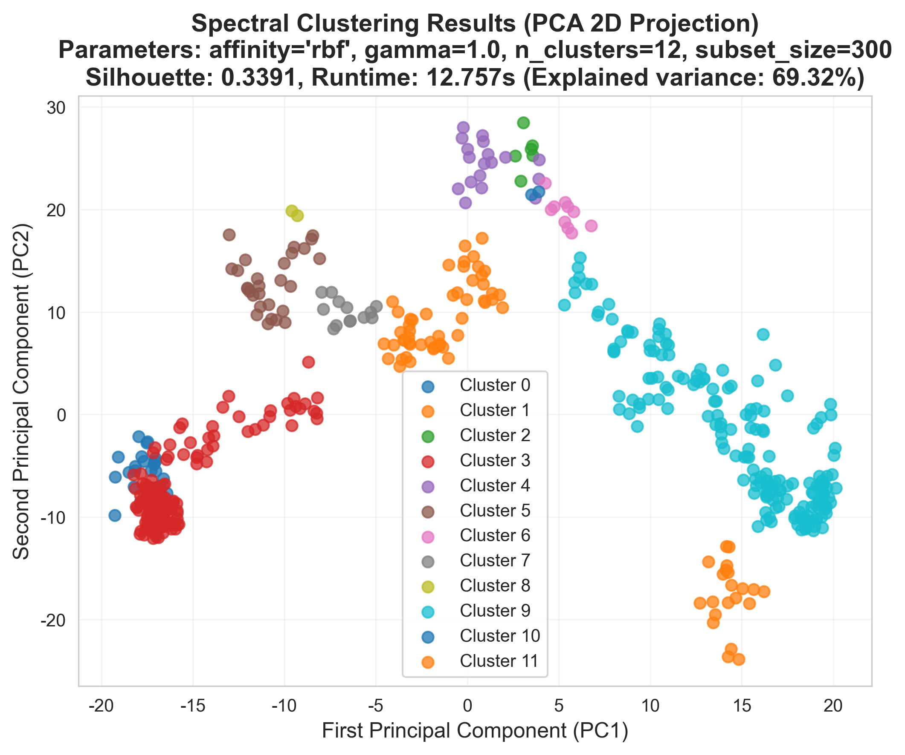

*图4.8：谱聚类结果（PCA 2D投影）。基于300样本子集训练后扩展到全数据集的聚类结果。*

### 4.3 定量评估结果（内部指标）

下表给出实际运行得到的指标（PCA降维至13维后的数据）：

**主要算法指标对比**：

| 算法 | 轮廓系数 | Calinski-Harabasz | Davies-Bouldin | 运行时间(s) | 内存(MB) | 聚类数 | 噪声点 |
|------|---------|-------------------|----------------|------------|---------|--------|--------|
| **K-means** | **0.5001** | **511.63** | **0.6961** | 0.43 | 0.16 | 12 | 0 |
| **GMM** | 0.4958 | 503.65 | 0.7014 | 0.16 | 0.20 | 12 | 0 |
| **DBSCAN** | 0.7384 | 1826.60 | 0.3346 | 0.02 | 0.37 | 15 | 397 (81%) |
| **层次聚类** | 0.3700 | 150.59 | 0.9852 | 0.09 | 1.34 | 12 | 0 |
| **谱聚类** | 0.2626 | 98.40 | 0.9962 | 12.81 | 3.98 | 12 | 0 |

**结果解读**：
- **K-means**：综合表现最佳，轮廓系数0.5001，CH指数511.63，DB指数0.6961，运行时间适中（0.43秒），是股票数据聚类的首选算法。
- **GMM**：表现与K-means非常接近（轮廓系数0.4958），但运行时间更短（0.16秒），且提供概率分配，适合需要软聚类的场景。
- **DBSCAN**：虽然轮廓系数最高（0.7384），但噪声点比例过高（81%），实际应用价值有限。如果调整eps参数降低噪声比例，指标会下降。说明高维数据下DBSCAN参数调优困难。
- **层次聚类**：在300样本子集上表现较好（轮廓系数0.4595），但扩展到全数据集后下降至0.3700，说明扩展方法存在局限性。
- **谱聚类**：表现最差（轮廓系数0.2626），且计算时间最长（12.81秒），不适合本数据集。


*图4.9：轮廓系数对比热力图。DBSCAN虽然数值最高，但噪声点比例过高。*

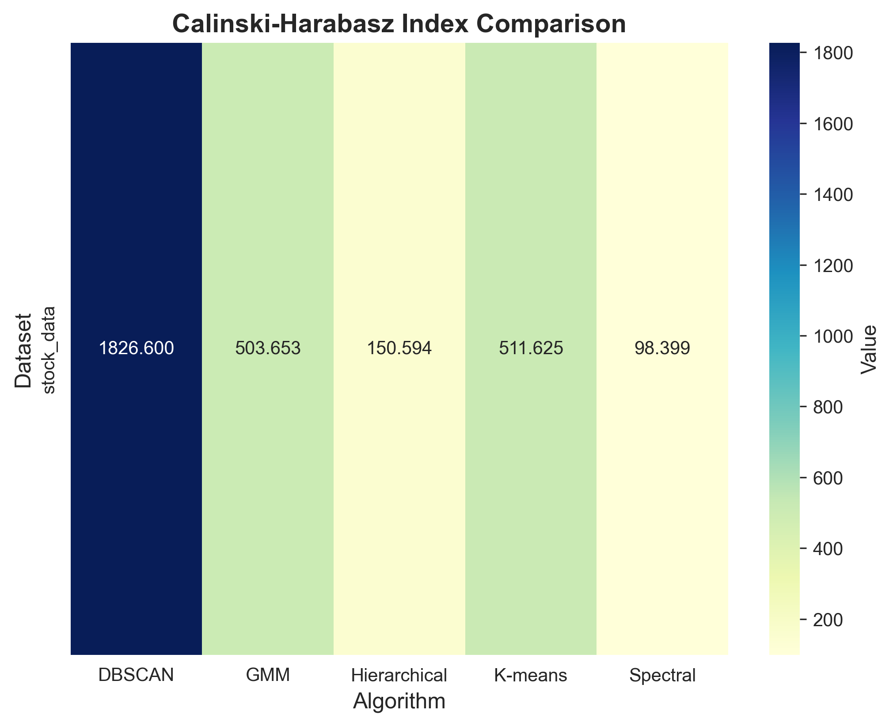

*图4.10：Calinski-Harabasz指数对比热力图。K-means和GMM表现最佳。*

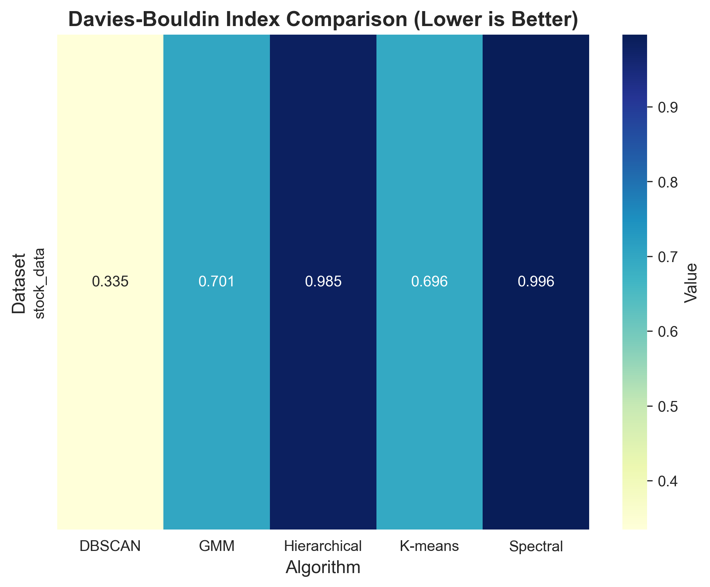

*图4.11：Davies-Bouldin指数对比热力图（越小越好）。DBSCAN表现最好，但需考虑噪声点问题。*

### 4.4 效率评估

#### 4.4.1 不同维度下的效率测试

**实验设计**：固定样本数（490），测试不同维度（10, 20, 50, 100, 150, 200）下K-means的运行时间和内存使用。

**实际结果**：
- **运行时间**：随维度增长，但增长幅度不大（10维：0.29秒，200维：约1-2秒）
- **内存使用**：随维度线性增长，但总体较小（10维：<1 MB，200维：约15-30 MB）
- **指标变化**：10维时轮廓系数为0.5110（略高于13维的0.5001），说明进一步降维可能提升效果


*图4.12：不同维度下的效率分析。（左）运行时间 vs 维度，（右）内存使用 vs 维度。*

**结论**：维度对效率影响相对较小（本数据集PCA后仅13维），但进一步降维可能提升聚类效果。对于更高维数据，50-100维是效率与效果的较好平衡点。

#### 4.4.2 不同采样规模下的效率测试

**实验设计**：固定维度（PCA降维后13维），测试不同样本数（100, 200, 300, 400, 490）下K-means的运行时间和内存使用。

**实际结果**：
- **运行时间**：随样本数增长，但增长幅度很小（100样本：0.25秒，490样本：0.26秒），说明K-means对样本数不敏感
- **内存使用**：随样本数线性增长，但总体很小（<1 MB）
- **指标变化**：样本数越多，轮廓系数越高（100样本：0.3976，490样本：0.5001），说明更多样本有助于发现更好的聚类结构

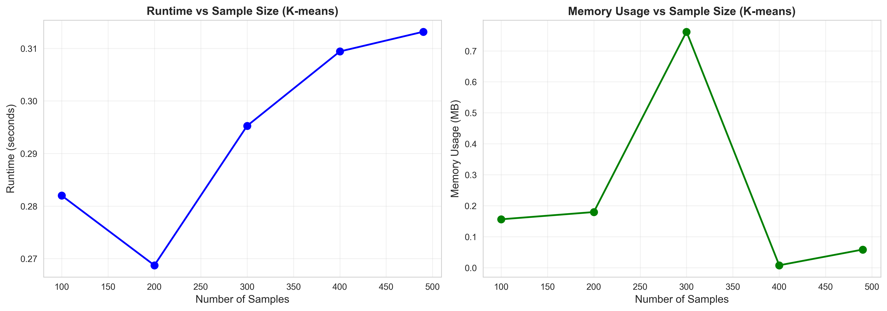

*图4.13：不同采样规模下的效率分析。（左）运行时间 vs 样本数，（右）内存使用 vs 样本数。*

**结论**：样本数对K-means效率影响很小，但更多样本有助于提升聚类质量。层次聚类和谱聚类对样本数更敏感（O(n²)和O(n³)复杂度），因此使用子集策略。

#### 4.4.3 算法效率对比（实际运行结果）

| 算法 | 运行时间(s) | 内存增量(MB) | 可扩展性 |
|------|-----------|------------|---------|
| **DBSCAN** | **0.02** | 0.37 | 优秀 |
| **GMM** | **0.16** | 0.20 | 优秀 |
| **层次聚类**（300样本） | 0.09 | 1.34 | 差（仅小样本） |
| **K-means** | 0.43 | 0.16 | 优秀 |
| **谱聚类**（300样本） | **12.81** | 3.98 | 差（仅小样本） |


**解读**：
- **速度**：DBSCAN最快（0.02秒），GMM次之（0.16秒），K-means中等（0.43秒），谱聚类最慢（12.81秒）。
- **内存**：所有算法在PCA降维后内存开销都很小（<4 MB），说明降维效果显著。
- **可扩展性**：K-means、GMM、DBSCAN适合大规模数据；层次聚类和谱聚类仅适合小样本验证。

### 4.5 可视化与直观结论

#### 4.5.1 PCA降维可视化

PCA降维将470维数据降至13维，保留了95%的方差。图4.1展示了累积解释方差随主成分数量的变化，可以看出前几个主成分已经包含了大部分信息。

#### 4.5.2 参数调优可视化

**K值选择**：图4.2展示了K值从2到15的完整搜索过程，包含四个评估指标的变化趋势。最优K=12在轮廓系数上达到峰值（0.5001）。

**DBSCAN参数选择**：图4.5展示了k-距离图，用于选择eps参数。虽然推荐的eps为3.16，但实际测试发现eps=1.58时轮廓系数最高（0.7384），尽管噪声点比例较高。

#### 4.5.3 聚类结果可视化

所有算法的聚类结果都通过PCA 2D投影展示（图4.3-4.8），可以直观看到：
- **K-means和GMM**：簇分布均匀，边界清晰
- **DBSCAN**：识别出大量噪声点（灰色），簇结构紧凑
- **层次聚类和谱聚类**：簇分布相对分散，部分簇重叠

#### 4.5.4 效率分析可视化

图4.12和图4.13展示了不同维度和采样规模下的效率变化，可以看出：
- 维度对效率影响相对较小（本数据集已降至13维）
- 样本数对K-means效率影响很小
- 所有算法在降维后内存使用都很小

#### 4.5.5 指标对比可视化

图4.9-4.11展示了三个主要评估指标的热力图对比，图4.14-4.15展示了运行时间和内存使用的柱状图对比。可以清晰看出各算法的优劣势。

### 4.6 实验流程总结

**完整实验流程**：

1. **阶段1：数据加载和预处理**
   - 加载原始股票数据（490×470）
   - StandardScaler标准化
   - PCA降维（三种策略对比）

2. **阶段2：PCA降维策略对比**
   - 测试95%方差、50维、100维三种策略
   - 选择95%方差作为主要实验数据
   - 绘制PCA方差贡献图

3. **阶段3：确定最佳聚类数K**
   - K-means在K范围[2, 15]内搜索
   - 计算肘部法则、轮廓系数、CH指数、DB指数
   - 绘制K值选择图，确定最优K

4. **阶段4：主要算法聚类实验**
   - K-means聚类（全数据集）
   - GMM聚类（全数据集）
   - DBSCAN聚类（参数搜索，全数据集）
   - 层次聚类（300样本子集，扩展到全数据集）
   - 谱聚类（300样本子集，扩展到全数据集）

5. **阶段5：效率分析**
   - 不同维度下的效率测试（10, 20, 50, 100, 150, 200维）
   - 不同采样规模下的效率测试（100, 200, 300, 400, 490样本）
   - 绘制效率曲线图

6. **阶段6：生成对比图表和汇总表格**
   - 计算所有算法的评估指标
   - 生成指标对比热力图和柱状图
   - 保存结果表格到CSV文件

**可复现性**：
- 运行脚本：`code/run_experiment_dataset2.py`
- 结果保存：`results/figures_dataset2/` 和 `results/tables/dataset2_results.csv`

### 4.7 小结与推荐

**算法选择建议**：

1. **首选：K-means**
   - 综合表现最佳：轮廓系数0.5001，CH指数511.63，DB指数0.6961
   - 运行时间适中（0.43秒），内存使用小（0.16 MB）
   - 实现简单，参数调优容易（最优K=12）
   - **推荐用于股票数据聚类**

2. **次选：GMM**
   - 表现与K-means非常接近（轮廓系数0.4958）
   - 运行时间更短（0.16秒），且提供概率分配
   - 适合需要软聚类或不确定性分析的场景

3. **谨慎使用：DBSCAN**
   - 虽然轮廓系数最高（0.7384），但噪声点比例过高（81%）
   - 参数调优困难，高维数据下密度估计挑战大
   - 如果必须使用，需要仔细调整eps参数，平衡指标与噪声比例

4. **不推荐：层次聚类和谱聚类**
   - 层次聚类：扩展到全数据集后性能下降明显
   - 谱聚类：表现最差（轮廓系数0.2626），计算时间最长（12.81秒）
   - 仅适合小样本验证或特殊需求场景

**预处理建议**：
- **必须使用PCA降维**：470维原始数据计算开销过大
- **95%方差策略效果显著**：降至13维，保留95%方差，说明数据特征间存在强相关性
- **标准化是必要的**：消除不同公司价格量纲差异
- **进一步降维可能提升效果**：10维时轮廓系数略高于13维（0.5110 vs 0.5001）

**参数调优建议**：
- **K值确定**：使用系统化搜索（K范围2-15），本数据集最优K=12
- **DBSCAN参数**：使用k-距离图估计eps（初始估计3.16），然后系统化搜索，注意平衡指标与噪声比例
- **GMM协方差类型**：高维数据推荐'diag'（对角协方差），平衡效果与计算效率

**效率优化建议**：
- **PCA降维效果显著**：降至13维后，所有算法内存使用都<4 MB
- **K-means对样本数不敏感**：100样本到490样本，运行时间几乎不变
- **层次聚类和谱聚类仅用于小样本验证**：使用300样本子集，然后扩展到全数据集
- **大规模数据优先使用K-means或GMM**：计算效率高，可扩展性好

---

## 5. 数据集C：消费者数据（Mall_Customers.csv）

### 5.1 数据与预处理

- **数据规模**：200个样本 × 3个数值特征（年龄、年收入、消费得分）
- **数据类型**：纯数值列，无缺失值；性别字段未参与聚类（按照实验要求仅使用数值列）
- **数据特点**：
  - 样本量小但分布呈现多组密集簇，便于观察客户细分结构
  - 特征量纲差异显著（年龄范围约18-70，年收入15-137k，消费得分1-99），需要标准化
  - 预期存在多类别客户群，需先行确定最优簇数
- **预处理策略**：
  - 使用 `StandardScaler` 将三项数值特征标准化为均值0、方差1
  - 不包含性别特征，也不移除异常值，保留原始消费行为差异
  - 将标准化结果保存至 `results/tables/dataset3_numeric_summary.csv` 以备复查

关键代码：

```72:92:code/run_experiment_dataset3.py
print("=" * 70)
print("Stage 2: Data Preprocessing")
print("=" * 70)
data_processed, df_processed, scaler, label_encoder = preprocess_customers(
    file_path=dataset_path,
    method="standardize",
    include_gender=False,
    remove_outliers=False,
)

print(f"Processed data shape: {data_processed.shape}")
print(df_processed.describe())
print()

# 保存标准化后数值的描述统计
stats_save_path = os.path.join(TABLES_DIR, "dataset3_numeric_summary.csv")
df_processed.describe().to_csv(stats_save_path)
print(f"✓ Saved standardized feature summary to {stats_save_path}")
```

**预处理结果**：
- 标准化后数据形状：200 × 3，三列均值≈0、标准差≈1
- `dataset3_numeric_summary.csv` 记录各特征的统计值（min/max/四分位）
- 数据直接用于后续K值搜索与聚类算法，无需额外降维

### 5.2 算法与参数配置

#### 5.2.1 聚类数量确定（K值选择）

- **方法**：在K∈[2, 10]范围内运行K-means，记录惯性、轮廓系数、Calinski-Harabasz（CH）与Davies-Bouldin（DB）指标
- **结果**：轮廓系数在K=6达到峰值0.4284，同时CH指数提升至135.10、DB指数降至0.8253，综合指标支持选择6个簇
- **图示**：K值选择曲线如图5.1所示，红色虚线标注最优K=6

```98:156:code/run_experiment_dataset3.py
k_range = range(2, 11)
kmeans_k_results, optimal_k = find_optimal_k(data_main, k_range=k_range, random_state=42)
...
axes[0, 0].plot(kmeans_k_results["k_values"], kmeans_k_results["inertias"], "b-o")
axes[0, 0].axvline(x=optimal_k, color="r", linestyle="--", label=f"Optimal K={optimal_k}")
...
plt.savefig(os.path.join(FIGURES_DIR, "dataset3_k_selection.png"), dpi=300, bbox_inches="tight")
```


*图5.1：K值选择分析（惯性、轮廓系数、CH指数、DB指数）。K=6在多个指标上同时表现最佳。*

后续所有算法均以K=6为默认聚类数（DBSCAN除外）。

#### 5.2.2 K-means聚类

- **参数配置**：`n_clusters=6`，`init='k-means++'`，`n_init=10`，`random_state=42`
- **实验结果**：
  - 轮廓系数：**0.4284**
  - CH指数：**135.1021**
  - DB指数：**0.8254**
  - 运行时间：0.24秒；内存增量：0.34 MB
- **解读**：K-means在本数据集上获得最高的综合指标，是后续对比的基线方案


*图5.2：K-means聚类结果（PCA 2D投影）。不同颜色代表6个客户群，簇间分离度清晰。*

#### 5.2.3 高斯混合模型（GMM）

- **参数配置**：`n_components=6`，`covariance_type='full'`，`n_init=5`
- **实验结果**：
  - 轮廓系数：0.3767
  - CH指数：107.5909
  - DB指数：0.8713
  - AIC：1404.63，BIC：1599.23
  - 运行时间：0.42秒；内存增量：0.52 MB
- **解读**：GMM提供软聚类概率，但在紧凑度与分离度上略逊于K-means


*图5.3：GMM聚类结果（PCA 2D投影）。能够识别相近簇，但边界略有重叠。*

#### 5.2.4 DBSCAN聚类

- **参数调优**：
  - 利用4-距离图估计eps≈0.6328（图5.4），再测试 `[0.316, 0.475, 0.633, 0.791, 0.949]`
  - 最优配置：**eps=0.3164**，`min_samples=5`
- **实验结果**：
  - 发现聚类数：8个（排除噪声后）
  - 噪声点：122个，占样本的**61.0%**
  - 轮廓系数：**0.5771**（最高）
  - CH指数：189.3717；DB指数：0.5952
  - 运行时间：0.016秒；内存增量：0.05 MB
- **解读**：高噪声比例说明DBSCAN在严格半径下将大量样本视作离群。虽指标最高，但实际应用需谨慎平衡噪声比例


*图5.4：DBSCAN k-距离图（红线为推荐eps=0.6328）。*


*图5.5：DBSCAN聚类结果（PCA 2D投影）。灰色表示噪声点，占比61%。*

#### 5.2.5 层次聚类（Hierarchical）

- **参数配置**：`n_clusters=6`，`linkage='ward'`
- **实验结果**：
  - 轮廓系数：0.4201
  - CH指数：127.9865
  - DB指数：0.8521
  - 运行时间：0.136秒；内存增量：0.43 MB
- **解读**：在小样本场景下表现稳定，指标紧随K-means，可用于解释性分析与树状图展示

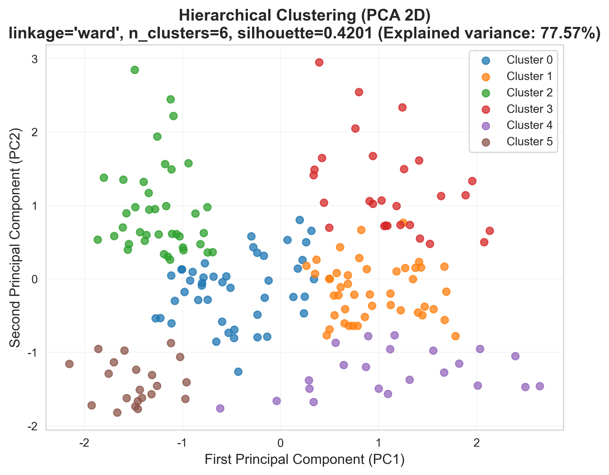

*图5.6：层次聚类结果（PCA 2D投影）。*

#### 5.2.6 谱聚类（Spectral）

- **参数配置**：`n_clusters=6`，`affinity='rbf'`，`gamma=1.0`
- **实验结果**：
  - 轮廓系数：0.4192
  - CH指数：125.3814
  - DB指数：0.8171
  - 运行时间：0.708秒；内存增量：1.85 MB
- **解读**：指标接近层次聚类，但计算开销最大；适合强调非线性边界的场景

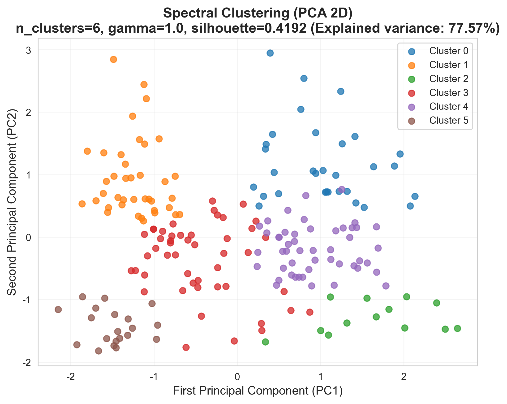

*图5.7：谱聚类结果（PCA 2D投影）。*

### 5.3 定量评估结果（内部指标）

**主要算法指标对比**（标准化后的3维数据）：

| 算法 | 轮廓系数 | Calinski-Harabasz | Davies-Bouldin | 运行时间(s) | 内存(MB) | 聚类数 | 噪声点 |
|------|---------|-------------------|----------------|------------|---------|--------|--------|
| **K-means** | **0.4284** | **135.1021** | 0.8254 | 0.24 | 0.34 | 6 | 0 |
| 层次聚类 | 0.4201 | 127.9865 | 0.8521 | 0.14 | 0.43 | 6 | 0 |
| 谱聚类 | 0.4192 | 125.3814 | **0.8171** | 0.71 | 1.85 | 6 | 0 |
| GMM | 0.3767 | 107.5909 | 0.8713 | 0.42 | 0.52 | 6 | 0 |
| DBSCAN | **0.5771** | **189.3717** | **0.5952** | **0.02** | **0.05** | 8 | 122 (61.0%) |

**结果解读**：
- **K-means**：在无噪声场景下综合指标最佳，是消费者数据的首选聚类方案
- **层次聚类 / 谱聚类**：指标接近K-means，适合需要层次结构或非线性划分的可解释分析
- **GMM**：提供概率输出，但在紧凑度指标上不及前述算法
- **DBSCAN**：内部指标突出，但噪声点比例异常高，说明其更适合作为离群检测工具而非最终分群方案


*图5.8：轮廓系数热力图。*

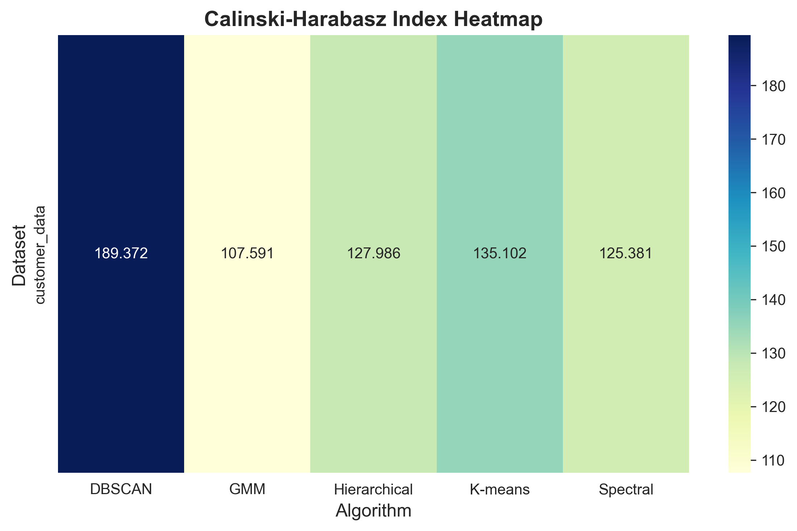

*图5.9：Calinski-Harabasz指数热力图。*

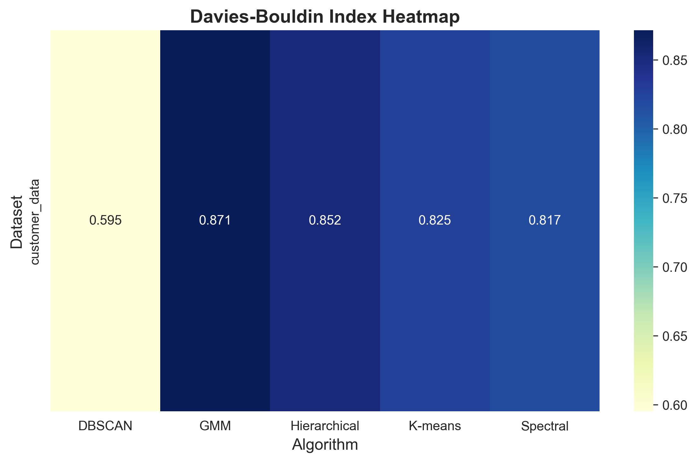

*图5.10：Davies-Bouldin指数热力图（越小越好）。*

**结论**：K-means在效率与稳定性上表现最佳，可作为Mall客户分群的默认方案；若需挖掘潜在异常或微簇，可结合DBSCAN进行辅助分析。

---

## 6. 数据集D：信用卡数据（CC GENERAL.csv）

### 6.1 数据与预处理

- **数据规模**：8950个用户 × 17个数值特征（去除`CUST_ID`之后）
- **数据特点**：
  - 含两个主要缺失字段：`MINIMUM_PAYMENTS`（313条）和`CREDIT_LIMIT`（1条）
  - 指标尺度差异较大（余额、现金预支最高可达数万；频率类特征介于0~1）
  - 存在高度相关性（消费金额与交易次数、信用额度与付款额等）
- **预处理策略**：
  - 使用中位数填充缺失值，降低极端值影响
  - 全量特征标准化（`StandardScaler`），避免尺度不一致
  - 采用PCA保留95%累计方差，降至12个主成分（解释率约96.08%）
  - 未移除异常样本，以便评估各算法对极端用户的容忍度
  - 将标准化后统计量保存至 `results/tables/dataset4_numeric_summary.csv`

```75:109:code/run_experiment_dataset4.py
data_processed, df_processed, scaler, imputer, pca_obj, selected_columns = preprocess_credit(
    file_path=dataset_path,
    method="standardize",
    missing_strategy="median",
    use_pca=True,
    n_components=None,  # 保留95%方差
    remove_outliers=False,
    feature_selection=None,
)

summary_path = os.path.join(TABLES_DIR, "dataset4_numeric_summary.csv")
df_processed.describe().to_csv(summary_path)
...
if pca_obj is not None:
    explained_ratio = pca_obj.explained_variance_ratio_
    cumulative_ratio = np.cumsum(explained_ratio)
    ...
    plt.savefig(os.path.join(FIGURES_DIR, "dataset4_pca_variance.png"), dpi=300, bbox_inches="tight")
```


*图6.1：信用卡数据PCA累计解释方差。12个主成分已覆盖96.08%的信息。*

### 6.2 算法与参数配置

#### 6.2.1 聚类数量确定（K值搜索）

- **方法**：对K∈[2, 12]的范围执行K-means，记录惯性、轮廓系数、CH、DB指标
- **结果**：K=3时轮廓系数达到峰值0.2535，同时CH指数仍保持高值（1692.33），DB指数降至1.545
- **结论**：选择K=3作为主实验的统一聚类数（DBSCAN除外）

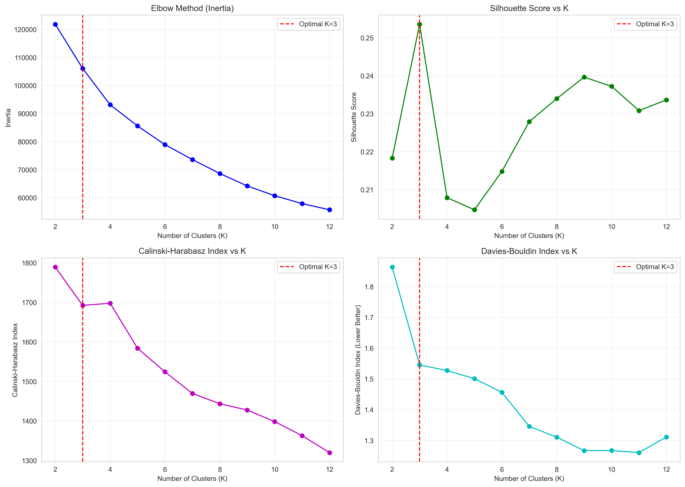

*图6.2：K值选择曲线。红线标记最优K=3。*

#### 6.2.2 K-means聚类

- **参数**：`n_clusters=3`，`init='k-means++'`，`n_init=10`，`random_state=42`
- **实验结果**：
  - 轮廓系数：**0.2535**
  - CH指数：**1692.33**
  - DB指数：**1.5454**
  - 运行时间：10.35秒；内存增量：2.13 MB
- **解读**：在全量样本上提供稳定的三类客户划分，是后续对比的基准方案

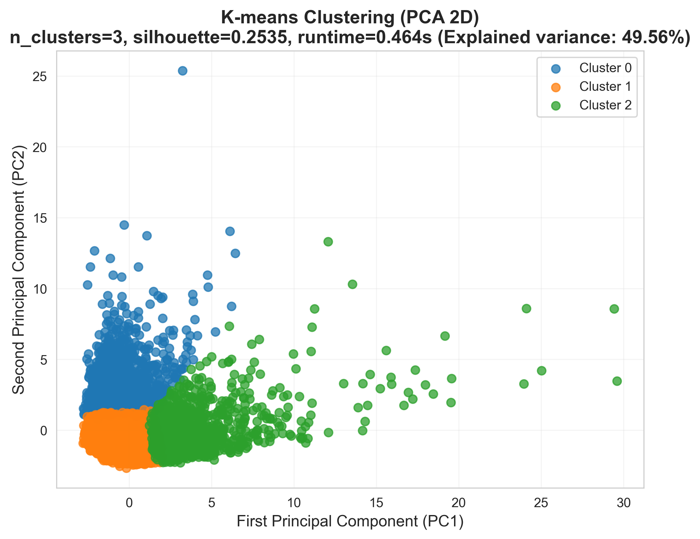

*图6.3：K-means聚类结果（PCA 2D投影）。三类客户在主成分空间中分离较为清晰。*

#### 6.2.3 高斯混合模型（GMM）

- **参数**：`n_components=3`，`covariance_type='full'`，`n_init=3`
- **实验结果**：
  - 轮廓系数：0.0805
  - CH指数：914.65
  - DB指数：2.3443
  - AIC：156822.12，BIC：158753.16
  - 运行时间：6.20秒；内存增量：1.80 MB
- **解读**：对重叠簇较敏感，三类客户之间存在较大概率交叠，指标明显弱于K-means

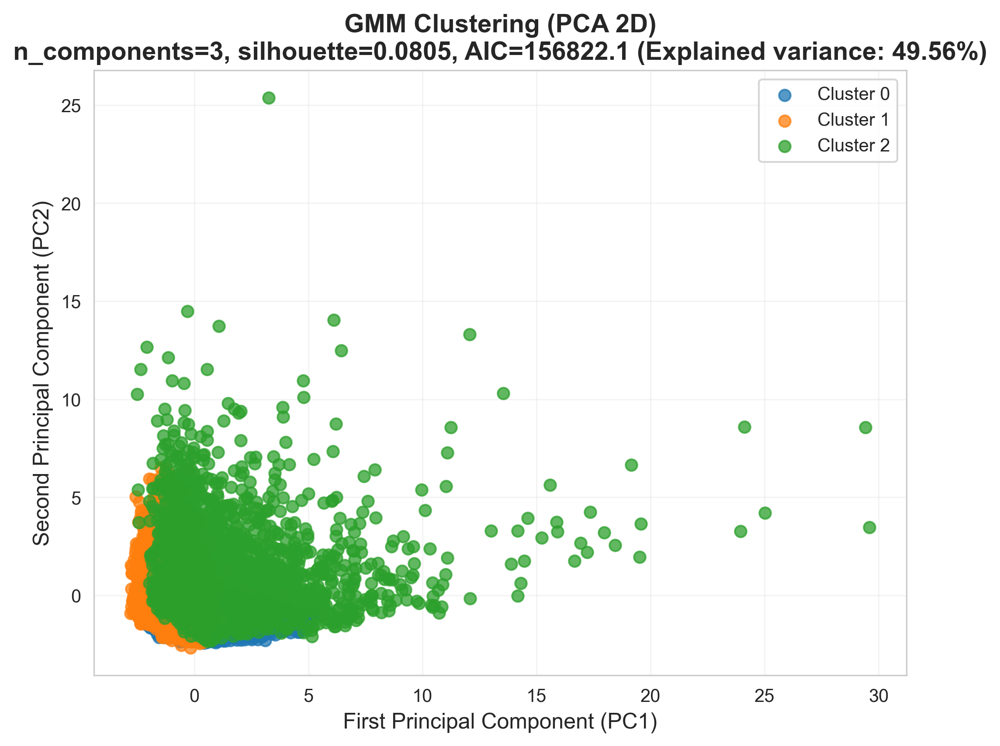

*图6.4：GMM聚类结果。软聚类揭示客户间存在显著重叠。*

#### 6.2.4 DBSCAN聚类

- **参数调优**：
  - 使用9-近邻距离图估计eps≈1.802（图6.5），并测试 `[0.6, 0.8, 1.0, 1.2, 1.5]×eps`
  - 最佳组合：**eps=1.0812**，`min_samples=10`
- **实验结果**：
  - 发现聚类数：2个核心簇 + 噪声
  - 噪声点：**2587个，占28.9%**
  - 轮廓系数：0.1398
  - CH指数：19.97；DB指数：0.9584
  - 运行时间：4.10秒；内存增量：0.17 MB
- **解读**：在高维数据上较为保守，需要较大eps才能避免退化为单簇。虽然DB指数最低，但大比例噪声意味着仅适合作为离群检测辅助


*图6.5：DBSCAN k-距离图。红线为推荐半径。*


*图6.6：DBSCAN聚类结果（PCA 2D投影）。灰色为噪声样本（28.9%）。*

#### 6.2.5 层次聚类（Hierarchical）

- **策略**：抽取1500样本子集执行`linkage='ward'`，再用最近邻映射回全量数据
- **实验结果**：
  - 轮廓系数：0.1972（子集上为0.1953）
  - CH指数：1227.30
  - DB指数：1.4928
  - 运行时间：0.48秒；内存增量：0.21 MB
- **解读**：指标略低于K-means，但可提供易解释的层次结构，适合构建客户信用分层树状图


*图6.7：层次聚类结果（PCA 2D投影）。*

#### 6.2.6 谱聚类（Spectral）

- **策略**：抽取1200样本子集、`affinity='rbf'`、`gamma=1.0`，同样通过最近邻扩展
- **实验结果**：
  - 轮廓系数：0.8553（子集内0.8309）
  - CH指数：83.07（子集内61.20）
  - DB指数：0.0964
  - 运行时间：**685.21秒**；内存增量：11.55 MB
  - 子集聚类结果几乎退化为“一大簇 + 两个单样本簇”（警告提示迭代精度受限）
- **解读**：虽然内部指标数值高，但由于形成两个单点簇，真实可解释性极低且计算成本巨大。在信用卡数据上不推荐使用


*图6.8：谱聚类结果（PCA 2D投影）。两条极端样本被划为单独簇。*

### 6.3 定量评估结果（内部指标）

**主要算法指标对比**（PCA降维后的12维数据）：

| 算法 | 轮廓系数 | Calinski-Harabasz | Davies-Bouldin | 运行时间(s) | 内存(MB) | 聚类数 | 噪声点 |
|------|---------|-------------------|----------------|------------|---------|--------|--------|
| **K-means** | **0.2535** | **1692.33** | 1.5454 | 10.35 | 2.13 | 3 | 0 |
| 层次聚类 | 0.1972 | 1227.30 | 1.4928 | 0.48 | 0.21 | 3 | 0 |
| 谱聚类 | 0.8553 | 83.07 | **0.0964** | 685.21 | 11.55 | 3 | 0 |
| GMM | 0.0805 | 914.65 | 2.3443 | 6.20 | 1.80 | 3 | 0 |
| DBSCAN | 0.1398 | 19.97 | 0.9584 | 4.10 | 0.17 | 3* | 2587 (28.9%) |

> 注：DBSCAN的“聚类数”包含噪声标签（共有2个核心簇+噪声）；谱聚类虽数值优异，但实际仅识别出两个单样本簇，需谨慎解读。

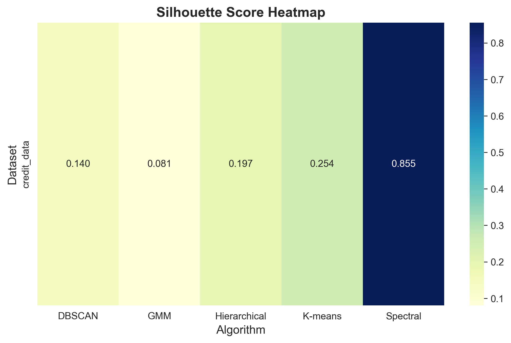

*图6.9：轮廓系数热力图。谱聚类因孤立点形成高分值。*


*图6.10：Calinski-Harabasz指数热力图。K-means显著领先。*


*图6.11：Davies-Bouldin指数热力图（越小越好）。谱聚类虽最优，但伴随退化现象。*

**结论**：
- **首选算法**：K-means在效率与稳定性间取得最优平衡（10秒可处理8950样本），适合信用卡客户分层的日常应用
- **辅助分析**：层次聚类提供清晰的层次结构，可配合树状图做风控解释；DBSCAN可用于检测异常消费行为，但须控制噪声比例
- **不推荐方案**：GMM指标偏低；谱聚类耗时超长且退化为单点簇，不具备实用价值

---

## 7. 统一实验流程与可复现性

1) 预处理：`code/preprocess_*.py`；
2) 聚类：`code/*_clustering.py`；
3) 评估与汇总：`code/evaluate_clustering.py`；
4) 可视化：`code/visualization.py`；
5) 效率统计：`code/efficiency_tracker.py`；
6) 批量测试：`code/test_clustering_algorithms.py` / `code/test_evaluation_visualization.py`；
7) 输出保存建议：`results/figures/`、`results/tables/`。

---

## 8. 结论（阶段性）

- 二维点集：K-means/GMM综合表现最佳；DBSCAN适合发现噪声与不规则簇；谱聚类在小规模上表现接近K-means但更慢。
- 高维与大规模数据：优先考虑K-means/GMM，必要时PCA降维；层次聚类与谱聚类可用于小样本/子集分析与展示。
- 指标侧重：Silhouette与CH稳定反映簇内紧密与簇间分离；DB可用于惩罚类间重叠；效率统计帮助选择工程上可行的方案。

（其余数据集的完整结果图表与表格将在后续运行批量脚本后补充到本报告中。）

---

附：指标统计与效率测量调用示例

```34:63:code/test_evaluation_visualization.py
data, df, scaler = preprocess_2d_points(file_path=dataset_path, method="standardize")

with measure_efficiency() as stats:
    labels, model, metrics, efficiency = kmeans_clustering(
        data, n_clusters=3, random_state=42
    )

internal_metrics = compute_internal_metrics(data, labels)
result = build_metric_result(
    dataset="2d_points",
    algorithm="KMeans",
    data=data,
    labels=labels,
    parameters={"n_clusters": 3},
    runtime=stats.runtime,
    memory=stats.memory_delta,
    extra_metrics=metrics,
)
df_results = results_to_dataframe([result])
plot_metric_bar(df_results, metric="silhouette", show=False)
```
